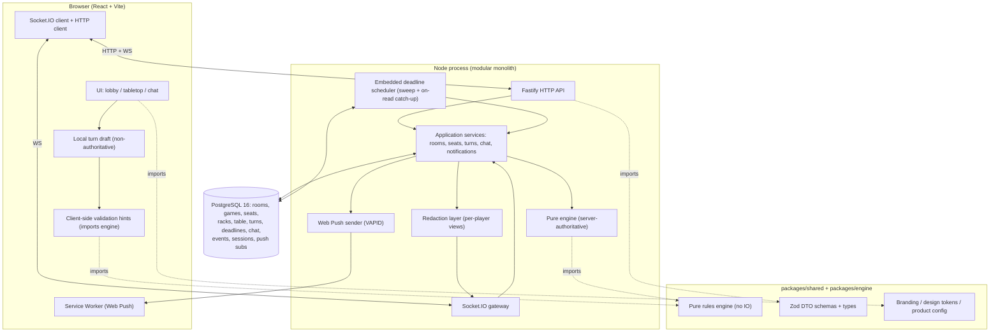

# Tile Meld — Opus Implementation Plan (Planning Deliverable)

> **Phase:** Planning only. This document is the complete planning deliverable requested by
> `tile-meld-opus-planning-prompt.md`, revised per a follow-up correction pass (see the change log at
> the end). No application code has been written, no dependencies installed, and no Git commands run.
> The only file touched is this planning document (created and then revised under explicit instructions
> to save the plan to `docs/opus-implementation-plan.md`).
>
> **Model handoff:** Written under Opus for planning. Implementation is intended for Sonnet,
> one approved phase at a time, with a manual Git checkpoint between phases.

---

## 0. How to read this document

Sections 1–15 map one-to-one to the "Planning deliverables" list in the prompt. Where the prompt
asked for an explicit recommendation on an unresolved choice, the recommendation is called out in a
**Decision** callout so it is easy to find and approve or override. A consolidated list of every
decision is in [Appendix A](#appendix-a--consolidated-decision-register).

---

## 1. Repository assessment

### 1.1 Current contents

| Path | Purpose | Keep? |
| --- | --- | --- |
| `tile-meld-opus-planning-prompt.md` | Authoritative product/engineering spec | Yes — source of truth |
| `.claude/settings.local.json` | Narrow read-only permission allowlist — only `--version` probes for `npm`, `pnpm`, `docker`, `psql`, `git` | Yes — keep narrow; see §1.6 for the Git-permission risk |
| `docs/opus-implementation-plan.md` | This plan | Yes |

- Git: branch `main`, single commit `81b89bd "first commit"`. Working tree otherwise empty of code.
- Two sibling directories exist outside the repo (`../cave-bot`, `../cavebot-inspection-prompt.txt`); they are unrelated and out of scope.

### 1.2 Technologies present

None yet. The repo is a greenfield. The `settings.local.json` allowlist is a strong signal that the
intended toolchain is **pnpm + Docker + PostgreSQL**, which matches the prompt's proposed stack and is
adopted below.

### 1.3 Tooling on the machine (checked, read-only)

- `git 2.43.0` — present.
- `node`, `npm`, `pnpm`, `docker`, `psql` — **not currently on PATH.**

> **Constraint for Sonnet:** installing Node.js / pnpm / Docker / PostgreSQL is a *system-level*
> action. Per the workflow rules, Sonnet must ask before installing system packages. The plan below
> standardizes on **Node.js 24 LTS** and **pnpm 11**, plus Docker Engine + Compose v2 and PostgreSQL 16.
> Node 20 is not used (it reaches end-of-life and is excluded). These versions are pinned in the repo
> during Phase 0 (see §13).

### 1.4 Useful existing work, gaps, constraints

- **Useful:** the spec itself is unusually complete and effectively *is* the requirements register.
- **Gaps:** everything (scaffolding, engine, server, client, tests, CI, deploy) is to be built.
- **Constraints:** friends-first but public-capable; low-cost single-host deployment; asynchronous
  turns that must survive restarts; strict server authority and rack secrecy; accessibility and
  original branding are hard requirements, not nice-to-haves.

### 1.5 File-change confirmation

**During repository inspection I made no file changes.** The only write performed by this task is
creating and then revising this planning document, done under the explicit wrapping instruction to save
the plan to `docs/opus-implementation-plan.md`. No app code, no dependency installs, no Git commands.

### 1.6 `.claude/settings.local.json` and the Git-write risk

The current allowlist is **narrow and safe**: every entry is a `… --version` probe (including
`Bash(git --version)`), which cannot mutate anything. The risk is *future broadening*, not the present
file.

- **Risk:** adding a broad Git permission such as `Bash(git:*)` or `Bash(git)` to the allowlist would
  let the agent run Git write/history commands (`add`, `commit`, `push`, `reset`, `rebase`, …), which
  directly violates the workflow rule that Claude must never run Git write commands. A single wildcard
  entry silently re-enables the exact behavior the workflow forbids.
- **Recommendation (do not auto-apply):** keep Git permissions restrictive. If read-only Git inspection
  needs to run without prompts, allowlist only specific read-only forms rather than a wildcard, e.g.
  `Bash(git status)`, `Bash(git status --short)`, `Bash(git --no-pager diff)`,
  `Bash(git --no-pager diff --stat)`, `Bash(git --no-pager log*)`. **Never add `Bash(git:*)`.**
- **Defense in depth:** add a **PreToolUse hook** that inspects Bash commands and blocks any `git`
  invocation whose subcommand is a write/history command (`add`, `commit`, `push`, `pull`, `merge`,
  `rebase`, `reset`, `restore`, `clean`, `stash`, `tag`, `checkout`, `switch`, `branch`). A hook is
  enforcement the model cannot bypass, unlike guidance in `CLAUDE.md`.
- **Process:** any change to `settings.local.json` must be **proposed to the user first** (show the exact
  diff) and applied only after approval. This plan does not modify the settings file. See Decision
  **D-GITGUARD** and Phase 0.

---

## 2. Requirements restatement

### 2.1 The product in one paragraph

**Tile Meld** is a browser-based, asynchronous, turn-based multiplayer tile-melding game for 2–4
players, paced like Words With Friends. Players are identified by a display name plus a
cryptographically random recovery credential (no accounts in the MVP). Games are private (join by
code) or public (browsable lobby + Quick Join). A server-authoritative pure game engine enforces
Rummikub-style rules (runs, groups, jokers, 30-point initial meld). Turns have a durable deadline
(4/8/12/24 h, default 4 h) that advances play with a penalty even while everyone is offline. Live
updates and per-game chat run over WebSocket; deadlines and notifications survive server restarts.

### 2.2 MVP boundary

**In:** 2–4 player games; private + public rooms + Quick Join; name-based identity with secure
recovery; async turns with durable deadlines and forfeit penalties; full rules engine incl. jokers;
draw/resign/timeout/commit flows; per-game chat; in-app + Web Push notifications; rematch + cumulative
room score; responsive accessible UI with drag-drop and click/tap; Docker + non-Docker local dev; CI;
one low-cost production deployment.

**Out (explicit exclusions):** AI opponents, spectators, native apps, payments, leaderboards/lifetime
stats, social features, email notifications, Google sign-in/accounts, moderation tooling, tournaments,
voice/video, multiple themes, horizontal scaling/Kubernetes. Architecture must leave **seams** for
accounts/Google sign-in and AI opponents without building them now.

### 2.3 Contradictions, hidden assumptions, decisions required

| # | Issue | Resolution (recommended) |
| --- | --- | --- |
| C1 | Prompt body forbids file creation; wrapping task requires saving the plan to a file. | Wrapping instruction governs; write only this one doc. |
| C2 | "Public chat without moderation" is required but risky. | Keep it (do not silently drop), but ship minimal safety rails (length limit, sanitize/encode, rate limit, server-owned metadata) and record the risk. See §9. |
| C3 | Tile tally: "106 uniquely identifiable tiles" and "104 numbered + 2 jokers." | Consistent: 4×13×2 = 104 numbered + 2 jokers = 106. No contradiction. |
| C4 | "Draw Tile" when pool is empty. | Becomes an explicit **Pass** (draws zero, ends turn); passes feed stalemate detection. See §3. |
| C5 | Start with fewer players than selected capacity? | **Yes** — capacity is a maximum; host may start with ≥2. See §3/§10. |
| C6 | Tie for lowest rack at pool exhaustion. | Deterministic tiebreak: face value → tile count → turn-order proximity. See §3. |
| C7 | Session vs recovery credential relationship. | Recovery secret = long-term credential (hashed); short-lived opaque session token = working auth. See §5/§9. |
| C8 | Jokers=30 penalty vs joker "represented value" in scoring. | On a rack at game end a joker is always 30; when *played in a set* it contributes its represented value (initial-meld math). Both are true in their contexts. |
| C9 | Redaction: opponents see rack counts, never contents. | Enforced by a single server-side redaction function; the client is never trusted. See §7. |
| C10 | A redaction-safe event log cannot also be a complete deterministic replay source (it deliberately omits hidden tile identities). | Canonical state lives in the game/pool/rack/table records; the event log is a redaction-safe transition/audit trail only. No complete-reconstruction claim; no RNG seed-commitment. See §4.3/§5.1/§6, Decision D-EVENTLOG. |
| C11 | A broad Git permission in `.claude/settings.local.json` would contradict the never-run-Git-writes rule. | Keep the allowlist narrow; recommend a PreToolUse hook that blocks Git write subcommands; propose any settings change before applying. See §1.6, Decision D-GITGUARD. |

Hidden assumptions made explicit: single deployable process is acceptable for MVP (see §4/§8/§12);
"continuous hours" for the turn clock means wall-clock elapsed time including nights/weekends; the
starting player is chosen by the server, not by a physical draw.

---

## 3. Rules specification and edge-case register

### 3.1 Formal rules

**Tiles.** 106 tiles: for each `color ∈ {C1,C2,C3,C4}` and `value ∈ 1..13`, two tiles (`copy ∈ {a,b}`)
= 104 numbered; plus 2 jokers. Every physical tile has a unique immutable `tileId`. Two tiles may share
`(color, value)` yet always differ by `tileId`. Jokers have no intrinsic color/value.

**Sets (min length 3):**

- **Run:** ≥3 tiles, same color, strictly consecutive ascending values, no duplicate value, `1` is low
  only, no `13→1` wrap, no wraparound. Max length 13.
- **Group:** 3 or 4 tiles, all the same value, all distinct colors. Max length 4.

**Joker in a set:** a joker occupies exactly one position and represents the single `(color,value)` that
makes the set valid at that position. In a 3-tile group missing two colors, either missing color is a
legal representation (choose deterministically — see E-J3).

**Initial meld.** Before a player may touch any table tile, they must, in one turn, lay one or more new
valid sets whose combined *represented face value* ≥ 30, using **only tiles from their own rack**.
Jokers count as the value they represent. During that turn the player may not add to / split / combine /
rearrange existing table sets. `hasCompletedInitialMeld` is persisted per player.

**Normal play (after initial meld).** May create, extend, split, combine, and rearrange table sets. The
committed play must add **≥1 tile from the active player's rack** to the table. At end of turn every
table tile belongs to exactly one valid set; **no loose tiles**. A table tile may never move to a rack.
No tile may be created, lost, duplicated, swapped for a look-alike, or moved to the wrong rack
(conservation invariant on the multiset of `tileId`s).

**Jokers in normal play.** A table joker may be retrieved only after the retriever has completed their
initial meld, and only if every affected set remains valid after replacement/rearrangement. Replacement
tiles may come from the rack or from legal table rearrangement. A retrieved joker becomes unrestricted
but **must** be played into a new valid set the same turn; it may not go to a rack or be held. The turn
must still add ≥1 rack tile. A joker left on a rack at game end = 30-point penalty.

**Draw / resign.**

- **Draw Tile:** draws exactly one random tile if available; immediately ends the turn; the drawn tile is
  unusable until the player's next turn. If the pool is empty, Draw becomes **Pass** (draw zero, end turn).
- **Resign:** removed from rotation; rack is **not** returned to the pool and counts against them; in 3–4
  player games play continues while ≥2 active players remain; in a 2-player game resignation immediately
  awards the game to the other player.

**Winning & scoring.**

- *Normal win:* a legal committed turn empties the rack. Each non-winner scores `-(rack face value,
  joker=30)`; winner scores `+Σ|non-winner scores|`. (Zero-sum.)
- *Pool exhausted / no plays:* winner = the **active** player with the lowest rack total (tiebreak
  E-TIE). Scoring — with resigned players never rewarded for a small frozen rack:
  - **Active non-winners** score `-(theirRack − winnerRack)` (the negative difference to the winner).
  - **Resigned players** score `-(their entire frozen rack total, joker=30)` — the full rack, *not* a
    difference, so a resigned player can never gain from having fewer tiles than the winner.
  - **Winner** scores the opposite of the combined total of every other player's (active + resigned)
    negative, keeping the game zero-sum.
  See E-RESIGNN for the worked interaction.

### 3.2 Edge-case register with recommended decisions

| ID | Case | **Decision** |
| --- | --- | --- |
| E-START | Choose starting player fairly. | Server draws uniformly at random among seated players using a CSPRNG at game start; the resulting starting seat is recorded as a redaction-safe event. (No RNG seed-commitment is stored — see C10. Simulated "everyone draws a tile, high tile starts" adds nothing because there is no rearrangement of that draw.) |
| E-SHUFFLE | Fair shuffle / draw. | Fisher–Yates over the 106-tile array using Node `crypto.randomInt` (cryptographically secure). Persist the resulting pool order as canonical state; draws pop deterministically from the persisted order. Canonical state — not the redaction-safe event log — is the source of truth for the current game (see C10). |
| E-TIE | Tie for lowest rack at pool exhaustion. | Break by: (1) lowest face value [given] → (2) fewest tiles → (3) player nearest in turn order starting from the player who would act next after the game-ending turn. Fully deterministic, never a shared win. |
| E-STALE | Stalemate / "no more plays." | **Consecutive-pass policy** (not an exhaustive solver): once the pool is empty, if every active player, in one full rotation, ends a turn without adding a rack tile (voluntary Pass, or a commit that adds nothing which is illegal anyway, or a timeout forfeit), the game ends and lowest-rack wins via the pool-exhaustion rule. A player who makes a legal play resets the consecutive-pass counter. This is decidable, cheap, and predictable. |
| E-EMPTYDRAW | Draw with 0 tiles in pool. | Becomes Pass: draw zero, end turn, increment consecutive-pass counter. |
| E-PEN0/1/2 | 3-tile penalty when pool has 0/1/2 tiles. | Draw `min(3, poolCount)`; if 0, draw none but still forfeit and advance. Applies to both timeout and invalid-commit penalties. |
| E-PENSCOPE | *When* the invalid-commit 3-tile penalty applies. | Charged **only** when an authenticated, authorized, currently-active player submits a **structurally valid, current-version** arrangement (well-formed payload, `expectedVersion == games.version`, correct `turnId`, not expired) that then **fails game-rule validation** in the engine. **Never** charged for: stale/expired version, duplicate/idempotent replay, malformed/oversized payload, expired turn (that is the timeout path), authorization failure, connection drop, or server error — those are rejected and leave the turn untouched. See §7.6. |
| E-CAP | Start with fewer than selected capacity. | Capacity is a **maximum**. Host may Start Game with ≥2 seated players. On start, unfilled seats are closed and the game locks to present players. Public Quick-Join can fill seats only until the host starts or capacity is reached. |
| E-RESIGN2 | 2-player resignation. | Immediate win for the other player. Score as a normal win using the resigner's current rack as the sole loser's rack: resigner `-(rack, joker=30)`, winner `+that`. |
| E-RESIGNN | Resignation in 3–4 player games and later scoring. | Resigned player leaves rotation; their rack is frozen (unchanged thereafter). At game end they are treated as a non-winner: **in a normal win** their frozen rack is a loser total, `-(frozenRack, joker=30)`. **In pool-exhaustion** they score `-(entire frozen rack)` — the full rack, **not** the difference-to-winner used for active non-winners — so a resigned player is never rewarded when their frozen rack happens to be smaller than the winner's rack. The winner absorbs the opposite of the combined total. *Worked example:* winner rack 5; active non-winner rack 12 → `-(12−5) = -7`; resigned rack 3 → `-3` (**not** `+2`); winner `+(7+3) = +10`. Zero-sum. |
| E-ABANDON | Abandoned started games. | No special handling needed: the durable deadline engine keeps forfeiting and advancing until a normal/exhaustion end is reached. Truly idle games therefore self-terminate. Never-started rooms are cleaned up on a schedule (see §6 retention). |
| E-J1 | Initial meld exactly 30 vs 29 vs 31. | 30 passes; 29 fails; 31 passes. Represented value of jokers included. |
| E-J2 | Multiple valid joker assignments in a run. | Validation only needs *existence* of a consistent assignment; scoring uses the assignment implied by the arrangement. Choose the lexicographically smallest consistent `(color,value)` per joker for the canonical record so results are deterministic across runs. |
| E-J3 | Joker in a 3-tile group, two colors missing. | Both missing colors are legal. Canonical representation = the missing color with the smallest color index. |
| E-J4 | Joker retrieval that would strand a loose tile. | Illegal: reject the whole commit; the arrangement must leave all table tiles in valid sets. |
| E-CONSERVE | Tile conservation. | The multiset of `tileId`s across {pool, all racks, all table sets} is invariant and asserted after every committed transition. Any violation is a server bug → transaction aborts. |

> **Highest-risk rules to test-drive first (see §11):** joker validation/retrieval, initial-meld
> boundary, tile conservation, and the invalid-commit/timeout penalty paths.

---

## 4. Architecture recommendation

### 4.1 Component diagram



### 4.2 Responsibilities & dependency boundaries

- **`packages/engine`** — pure functions: `applyCommit`, `validateSet`, `validateTurn`,
  `applyTimeout`, `applyDraw`, `applyResign`, `score`, `detectGameEnd`. **No** React, DB, network,
  `Date.now()`, or `Math.random`. Time and randomness are injected. This is the correctness core.
- **`packages/shared`** — Zod schemas + inferred TypeScript types for every HTTP/WS message, redacted
  view DTOs, and the **branding/design-token/product-config** module (name, palette, turn-limit
  options, tile symbols). Depends on nothing but Zod.
- **`apps/server`** — Fastify + Socket.IO + persistence (Kysely) + embedded scheduler + Web Push. Owns
  transactions, authorization, redaction, and orchestration. Calls the engine; never re-implements rules.
- **`apps/web`** — React + Vite. Renders redacted server state, manages the local draft, imports the
  engine for *non-authoritative* hints only, registers the service worker.
- **`e2e`** — Playwright multi-context tests.

**Dependency direction:** `web → shared, engine`; `server → shared, engine`; `engine → (nothing)`;
`shared → zod`. No cycles. The engine has zero infrastructure imports so it is trivially unit-testable
and reusable by a future AI opponent.

### 4.3 Why the engine is pure and server-authoritative

- **Correctness:** rules (esp. jokers) are the hardest part; isolating them as pure functions makes
  them exhaustively testable (unit + property-based) without spinning up a DB or browser.
- **Security:** the client cannot be trusted. The same engine runs on the server as the single source
  of truth; the client copy only lights up hints. A malicious client can never fabricate a legal state.
- **Determinism/audit:** with an injected clock and the persisted canonical state (pool order, racks,
  table), any committed transition is deterministic and re-checkable for dispute resolution. The
  redaction-safe event log is a human-auditable trail, **not** a complete replay source (see C10).
- **Future-proofing:** an AI opponent later is just another caller of the pure engine.

### 4.4 Stack confirmation / revisions

| Area | Proposed | **Recommendation** | Rationale / tradeoff |
| --- | --- | --- | --- |
| Repo | Single repo, all packages | **Confirm.** pnpm workspaces. | pnpm gives strict, fast, disk-efficient workspaces; matches the allowlist. |
| Runtime | Node.js | **Node.js 24 LTS + pnpm 11, both pinned.** | Node 20 is end-of-life and excluded. Pin via `.nvmrc`/`.node-version`, `engines`, and `packageManager` in Phase 0 (Decision D-RUNTIME). |
| Language | TypeScript everywhere | **Confirm**, `strict: true`. | Non-negotiable for a rules-heavy domain. |
| Frontend | React | **Confirm + Vite.** | Vite = fast dev/build, first-class TS, easy PWA/service-worker plugin. |
| Backend HTTP | Node.js | **Confirm; use Fastify (not Express).** | Native JSON-schema validation, better perf, first-class TS, plugin encapsulation. Tradeoff: smaller ecosystem than Express — acceptable. |
| Real-time | WebSocket/Socket.IO | **Socket.IO.** | Built-in rooms, reconnection, heartbeat, and fallback. Volume is tiny (async game). Tradeoff: heavier than raw `ws`, but the reconnection/room ergonomics are worth it for this app. |
| Shared engine | Pure TS package | **Confirm.** | See §4.3. |
| DB | PostgreSQL | **Confirm (PG 16).** | Transactions + `SELECT … FOR UPDATE SKIP LOCKED` are exactly what the turn/deadline logic needs. |
| DB access | (unspecified) | **Kysely query builder + a thin migration runner** (`kysely` migrations or `node-pg-migrate`). | Precise control over transactions and row locking, fully typed, no heavy runtime/magic. Alternatives: Drizzle (great DX, viable) or Prisma (heavier, weaker fine-grained locking). Decision D-ORM. |
| Validation | (unspecified) | **Zod** in `packages/shared`, reused on client + Fastify. | One schema, both sides; drives redaction DTOs. |
| Deadlines/jobs | Durable, PG-compatible | **Embedded scheduler: durable `turn_deadlines` rows + in-process sweep (`FOR UPDATE SKIP LOCKED`) + on-read catch-up.** | Cheapest reliable topology; no Redis. If a library is preferred, **Graphile Worker** (Postgres-only, cron, battle-tested) is the recommended drop-in. See §8. Decision D-SCHED. |
| Unit/integration tests | Vitest | **Confirm + `@fast-check/vitest`** for property tests. | Property tests are ideal for rules/conservation invariants. |
| E2E | Playwright | **Confirm.** | Multi-browser-context = multiple players; controllable clock for timeout tests. |
| Container | Docker from start | **Confirm** + keep a first-class non-Docker path. | Compose for parity; plain `pnpm dev` + local/Dockerized Postgres for Linux Mint. |
| CI | GitHub Actions | **Confirm.** | Format, lint, typecheck, unit/integration, then E2E; dependency + image scanning. |
| Lint/format | (unspecified) | **ESLint (typescript-eslint) + Prettier.** | Standard, CI-enforced. |
| Password/secret hashing | (unspecified) | **argon2id** for recovery-credential hashes; `crypto` for token generation. | Memory-hard, modern. |

**Architecture style:** a **modular monolith** — one deployable Node process containing HTTP + WS +
embedded scheduler, plus PostgreSQL. No microservices, no Kubernetes, no event sourcing (we keep an
append-only event *log* for audit, but canonical state lives in normal tables). This is the simplest
topology that satisfies durability and restart-safety (§8, §12).

---

## 5. Domain and state model

### 5.1 Core concepts

- **Room** — a durable container with a code, visibility (private/public), capacity (2–4), turn-limit
  setting, a host, and lifecycle status. Hosts a series of games (for rematches + cumulative score).
- **Room member** — a player's persistent membership in a room. **Room members exist before any game
  starts and persist across the between-games / rematch states.** A member carries the room-scoped
  display name, join time (for host succession), and per-game readiness. Membership is *not* a game seat.
- **Game (match instance)** — one playthrough within a room: pool order, table, turns, per-seat
  initial-meld flags, version, status, winner, scores. Owns its own chat history.
- **Game seat** — a player's place in **one specific game instance only**: seat index,
  active/resigned status, join order. Seats are created when that game starts (from the room members who
  are ready) and never outlive the game. A room member may hold a seat in game *n* and no seat in game
  *n+1* if they are not ready for the rematch.
- **Player identity** — a persistent `playerId` + hashed recovery credential; not tied to a socket.
- **Tile** — immutable `{tileId, kind: numbered|joker, color?, value?}`. The 106 tiles are a fixed
  catalog reused every game; per-game state is *where* each tile currently is.
- **Rack** — the private multiset of `tileId`s a seat holds. Redacted to a count for opponents.
- **Table set** — an ordered list of `tileId`s forming a run or group, with per-position joker
  representations recorded.
- **Turn** — `{turnId, gameId, seatIndex, startedAt, deadlineAt, status}` + optimistic `version`.
- **Deadline** — a durable row driving timeout processing (may be the turn row itself, see §8).
- **Chat message** — game-scoped, server-stamped sender + timestamp, length-limited, sanitized.
- **Notification subscription** — a Web Push subscription (endpoint + keys) per player/device + prefs.
- **Recovery identity** — argon2id hash of the recovery secret; raw secret shown once, never stored.
- **Score / result** — per-game final scores + a room-level cumulative tally.
- **Event** — append-only, redaction-safe transition/audit trail of state changes; a human-auditable
  record, **not** a complete replay source (canonical state is authoritative — see C10).

### 5.2 State machines

**Room:** `open` → (`in_game` ⇄ `between_games`) → `closed`/`abandoned`.
`open` accepts joins as room members; host `Start Game` moves to `in_game`; game end →
`between_games` (rematch possible, chat read-only) → host starts a rematch (≥2 ready members) →
new game returns to `in_game`; inactivity or all members leaving → `abandoned`/`closed`.
**Host succession:** if the host leaves, host control transfers automatically to the
**longest-present remaining eligible room member** (earliest join time).

**Room member:** `joined` → `ready`/`not-ready` (per game; readiness resets between games) →
(`left` | remains for the next rematch). Membership persists across `between_games`.

**Game:** `awaiting_start` → `active` → (`completed` | `abandoned-resolved-by-timeouts→completed`).
`active` cycles turns; end conditions (empty rack / pool-exhaustion+stalemate / 2p-resign) → `completed`.

**Game seat:** `seated` → `active` → (`resigned` | remains `active` to game end). Created at game start
from ready members; destroyed with the game. Sessions attach/detach freely without changing seat status.

**Turn:** `pending` → `active` (deadline armed) → one of `committed | drawn | passed | resigned |
timed_out` → advance to next active seat's `active` turn (arms next deadline). Every terminal turn
transition is atomic with the deadline re-arming.

### 5.3 Invariants (asserted in tests and after each transition)

1. **Conservation:** `⋃ tileId(pool) ⊎ ⋃ tileId(racks) ⊎ ⋃ tileId(table)` = the fixed 106-tile catalog,
   with no duplicates and nothing missing.
2. **No loose tiles** after any committed turn: every table `tileId` is in exactly one valid set.
3. **Rack secrecy:** no redacted view sent to a client contains another seat's `tileId`s.
4. **Turn singularity:** exactly one seat has an `active` turn per active game.
5. **Monotonic version:** `game.version` strictly increases on every committed transition; stale
   versions are rejected.
6. **Initial-meld gate:** a seat with `hasCompletedInitialMeld = false` never mutates pre-existing table
   sets.
7. **Rack-tile-used:** every committed (non-draw, non-pass) turn adds ≥1 rack `tileId` to the table.
8. **Resigned racks frozen:** a resigned seat's rack multiset never changes after resignation.
9. **Deadline liveness:** an `active` game always has exactly one future `deadlineAt` (or is being
   processed under lock).
10. **Seat provenance:** every `game_seats` row references a `room_members` row in the same room; a game
    seat never exists without a backing room membership.
11. **Single host:** every non-terminal room has exactly one host, always an existing room member.

---

## 6. Data model

### 6.1 Tables (PostgreSQL 16)

> Types abbreviated. All timestamps `timestamptz`. All ids `uuid` (default `gen_random_uuid()` via
> `pgcrypto`) unless noted. `jsonb` used only where a normalized shape adds no query value.

**`players`** — `id pk`, `created_at`, `recovery_hash text` (argon2id), `recovery_rotated_at`,
`display_name_default text?`. *No raw secret ever stored.*

**`sessions`** — `id pk`, `player_id fk`, `token_hash text` (hash of opaque cookie token), `created_at`,
`last_seen_at`, `expires_at`, `revoked_at?`. Index `(player_id)`, `(token_hash)`.

**`rooms`** — `id pk`, `code text unique` (case-normalized), `visibility enum(private,public)`,
`capacity smallint check 2..4`, `turn_limit_hours smallint check in (4,8,12,24)`, `status enum`,
`host_player_id fk`, `created_at`, `last_activity_at`. Partial index
`WHERE visibility='public' AND status='open'` for the lobby.

**`games`** — `id pk`, `room_id fk`, `seq int` (1st, 2nd… game in room), `status enum`,
`pool_order tileId[]` (persisted secure shuffle; draw pointer `pool_cursor int`), `active_seat smallint?`,
`current_turn_id fk?`, `version bigint`, `consecutive_passes smallint`,
`created_at`, `completed_at?`, `winner_seat smallint?`. Unique `(room_id, seq)`.
*(No `rng_seed_commit`: canonical `pool_order` is the persisted result of a CSPRNG shuffle; there is no
seed-commitment mechanism — see C10 / D-EVENTLOG.)*

**`room_members`** — `id pk`, `room_id fk`, `player_id fk`, `display_name text`, `joined_at`,
`is_ready bool` (readiness for the next game; reset between games), `left_at?`. Persists across the
between-games/rematch lifecycle. **Unique `(room_id, lower(display_name))`** (display-name uniqueness
within a room) and unique `(room_id, player_id)`. `joined_at` drives host succession (longest-present
eligible member). The room's host is `rooms.host_player_id`, always a current member.

**`game_seats`** — `id pk`, `game_id fk`, `room_member_id fk`, `player_id fk`, `seat_index smallint`,
`display_name text` (snapshot at game start), `status enum(active,resigned)`, `has_initial_meld bool`,
`join_order int`. Belongs to exactly one game instance. Unique `(game_id, seat_index)` and unique
`(game_id, room_member_id)`. Every seat references a `room_members` row (seat-provenance invariant).
Racks/turns/table rows key off `(game_id, seat_index)` as before.

**`racks`** — `game_id fk`, `seat_index smallint`, `tiles tileId[]`. PK `(game_id, seat_index)`.
*Hidden data; only ever returned to its owner.* (Alternative normalized form: one row per tile — see
§6.3; array form chosen for atomic swaps and simplicity.)

**`table_sets`** — `id pk`, `game_id fk`, `ordinal int`, `kind enum(run,group)`,
`tiles tileId[]`, `joker_repr jsonb` (position → {color,value}). Index `(game_id)`.

**`turns`** — `id pk`, `game_id fk`, `seat_index smallint`, `status enum`, `started_at`,
`deadline_at timestamptz`, `warned_at?`, `resolved_at?`, `version_at_start bigint`. Index
`(status, deadline_at)` for the sweep; **partial index `WHERE status='active'`**.

**`game_events`** — `id bigserial pk`, `game_id fk`, `seq int`, `type text`, `seat_index smallint?`,
`payload jsonb` (**redaction-safe**: never contains hidden rack contents of other players),
`created_at`. Unique `(game_id, seq)` — append-only.

**`idempotency_keys`** — `key text pk` (client-supplied per action), `player_id fk`, `game_id fk?`,
`result_hash text`, `created_at`. Dedupes retried commits/draws.

**`chat_messages`** — `id pk`, `game_id fk` (**always game-scoped, never room-scoped**),
`seat_index smallint?`, `sender_player_id fk`, `body text check length ≤ 500`, `created_at`
(server-stamped). Index `(game_id, created_at)`. Chat is scoped to one game instance and becomes
**read-only when that game reaches `completed`**; a rematch is a new game with a fresh, empty chat
history (see §10.8 / D-CHAT-SCOPE).

**`push_subscriptions`** — `id pk`, `player_id fk`, `endpoint text unique`, `p256dh text`, `auth text`,
`created_at`, `last_success_at?`, `failure_count int`. Deleted on `410 Gone`.

**`room_scores`** — `room_id fk`, `player_id fk`, `cumulative_score int`, `games_played int`,
`games_won int`. PK `(room_id, player_id)`.

**`schedule` / `turn_deadlines`** — see §8; may be folded into `turns.deadline_at` + the sweep index
(recommended) rather than a separate table.

### 6.2 Transaction boundaries

The **turn-commit** and **timeout** paths are the critical sections. Each runs in one serializable (or
read-committed + `SELECT … FOR UPDATE`) transaction that:

1. Locks the `games` row (`FOR UPDATE`), rechecks `version` + `current_turn_id` (optimistic-concurrency
   guard) and the idempotency key.
2. Loads canonical turn-start state, runs the pure engine.
3. On success: writes new racks/table_sets/pool_cursor, bumps `version`, appends `game_events`, closes
   the current turn, opens the next seat's turn (sets `deadline_at`), updates `room.last_activity_at`.
4. Commits atomically. Any failure rolls the whole thing back → canonical state cannot diverge.

### 6.3 Protecting hidden data & credentials

- Racks and `recovery_hash` are **never** selected into a broadcast path. A single `redactGameFor(seat)`
  function builds each player's view: own rack full, opponents' racks as counts only, no hashes/tokens.
- DB role for the app has least privilege (no superuser; only DML on the app schema). Backups are
  encrypted at rest (provider-dependent, §12).
- `game_events.payload` is constructed to be safe to show to *any* seat in the game (e.g. "Seat 2 drew a
  tile" not "Seat 2 drew C3-7b"), so audit does not leak.

### 6.4 Retention / cleanup policy (**Decision D-RETAIN**)

| Data | Retention |
| --- | --- |
| Never-started room, no activity | Delete room + room members (+ any seats) after **48 h** of inactivity. |
| Completed game — result summary + `room_scores` | Keep **long-term** (≥1 year; effectively indefinite for MVP). |
| Completed game — racks, full event log, chat | Purge **90 days** after completion. |
| Abandoned started game | Resolves itself via timeouts to `completed`, then follows completed-game rules. |
| Chat | Lives for the game's life; purged with the game's detail at 90 days. |
| Push subscriptions | Delete on `410 Gone`; prune after 60 days without a successful send. |
| Sessions | Expire after 30 days idle; hard-delete revoked/expired after 90 days. |
| `idempotency_keys` | Prune after 7 days. |

Cleanup runs as a low-frequency job in the same embedded scheduler (§8).

---

## 7. API and real-time contract

### 7.1 Principles

- **HTTP** for request/response resource ops (create/join room, lobby list, recovery, history).
- **Socket.IO** for live game state, turn events, chat, presence, and notifications-in-page.
- Every input (HTTP body/query, socket payload) is validated by a shared **Zod** schema server-side.
- Every response/broadcast passes through `redactGameFor(seat)`. Clients never receive hidden data.
- **Idempotency:** mutating actions carry a client-generated `idempotencyKey`; the server dedupes.
- **Optimistic concurrency:** mutating game actions carry `{gameId, expectedVersion, turnId}`; the
  server rejects stale versions/turns (`409 CONFLICT` / socket `error:stale`).

### 7.2 HTTP endpoints (planning level)

| Method + path | Purpose | Auth | Key I/O |
| --- | --- | --- | --- |
| `POST /api/identity` | Create player identity; returns `{playerId, recoverySecret}` **once** + sets session cookie. | none | out: secret shown once |
| `POST /api/session/recover` | Exchange recovery code/link for a session (this or another device). | recovery secret | in: `{recoverySecret}`; out: session cookie |
| `POST /api/session/rotate-recovery` | Rotate/revoke a recovery secret (issue new, invalidate old). | session | out: new secret once |
| `POST /api/rooms` | Create room `{capacity, visibility, turnLimitHours}`; creator becomes host + first member. | session | out: `{roomId, code}` |
| `POST /api/rooms/join` | Join private room by code (creates a room member). | session | in: `{code, displayName}` |
| `GET /api/rooms/public` | Browsable public lobby (paginated). | session | out: names, count/capacity, turn limit — **no secrets** |
| `POST /api/rooms/quick-join` | Join an eligible public room (creates a room member). | session | out: `{roomId}` |
| `POST /api/rooms/:id/ready` | Member marks self ready / not-ready for the next game. | session (member) | in: `{ready: bool}` |
| `POST /api/rooms/:id/leave` | Leave the room; triggers host succession if the host leaves. | session (member) | out: `{newHostPlayerId?}` |
| `POST /api/rooms/:id/start` | Host starts the first game from ready members (≥2 ready). | session (host) | out: `{gameId}` |
| `POST /api/rooms/:id/rematch` | Host starts a **new** game (new seats + fresh chat) from members who are **ready** (≥2). Not automatic; unready members excluded. | session (host) | out: `{gameId}` |
| `GET /api/games/:id` | Full redacted snapshot for reconnect. | session (seat) | out: redacted state + `version` |
| `GET /api/rooms/:id/history` | Completed results + cumulative scores. | session (member) | out: results |
| `POST /api/push/subscribe` / `DELETE …` | Manage Web Push subscription. | session | in: subscription |
| `GET /api/health` | Liveness/readiness. | none | out: ok + db check |

Rate limits applied per endpoint class (§9).

### 7.3 Socket.IO events

**Client → server** (all validated, idempotent where mutating):

- `game:join` `{gameId}` — subscribe to the game room (authorization checked).
- `turn:commit` `{gameId, expectedVersion, turnId, arrangement, idempotencyKey}` — proposed final table
  + which rack tiles were placed. Server validates against canonical turn-start state.
- `turn:draw` `{gameId, expectedVersion, turnId, idempotencyKey}`.
- `turn:pass` `{…}` (only legal when pool empty; UI presents Draw-as-Pass).
- `turn:resign` `{gameId, idempotencyKey}`.
- `chat:send` `{gameId, body}` (length-limited; server stamps sender+time).
- `presence:ping` — heartbeat for connection state.

**Server → client** (redacted per recipient):

- `game:state` — full redacted snapshot (on join/reconnect).
- `game:patch` — `{version, events[], changed}` incremental update after any transition.
- `turn:started` `{seatIndex, deadlineAt}` and `turn:warning` `{seatIndex, remainingMs}` (15-min mark).
- `turn:timeout` `{seatIndex, penaltyDrawn}`.
- `game:over` `{winnerSeat, scores, roomCumulative}`.
- `chat:message` `{seatIndex, senderDisplay, body, createdAt}` (server-authored metadata).
- `error` `{code, message}` — e.g. `stale`, `unauthorized`, `invalid`, `rate_limited`.

### 7.4 Redaction model

`redactGameFor(seat)` returns: own rack tiles in full; each opponent as `{seatIndex, displayName,
rackCount, status, hasInitialMeld}`; the full public table; pool count (not order); current turn +
deadline + version; no hashes, tokens, or other racks. All broadcasts are per-socket redacted (Socket.IO
room fan-out with per-recipient payloads).

### 7.5 Idempotency & concurrency (summary)

- Commit/draw/pass/resign carry `idempotencyKey`; a replay returns the original result, never re-applies.
- Every game mutation is gated on `expectedVersion == games.version` and `turnId == current_turn_id`
  under a `FOR UPDATE` lock. Stale tabs and duplicate submits are rejected with `stale`, and the client
  refetches `game:state`.

### 7.6 Exactly when the invalid-commit penalty fires (**Decision D-PENALTY**)

The 3-tile penalty is a game-rule consequence, not an error handler. It is applied **only** when
**all** of these hold for a `turn:commit`:

1. The caller is an **authenticated** session mapping to a **seat in this game**.
2. That seat is the **currently active** player and the turn has **not expired**.
3. The payload is **structurally valid** (passes Zod) and **not** a duplicate/idempotent replay.
4. `expectedVersion == games.version` and `turnId == current_turn_id` (**current version**, not stale).
5. The engine then judges the arrangement **illegal by the game rules**.

Only step 5 triggers the penalty (draw `min(3, poolCount)`, forfeit, advance, record reason). If any of
steps 1–4 fail, the request is **rejected with an error** (`unauthorized` / `stale` / `invalid` /
`rate_limited`) and the canonical board, rack, and turn are **left completely untouched** — no penalty.
Malformed payloads, stale/expired versions, duplicate submits, authorization failures, connection drops,
and server errors never cost tiles. (An *expired turn* is handled by the timeout path in §8.3, which is a
separate mechanism from invalid-commit.)

---

## 8. Turn deadline and notification design

### 8.1 Durable scheduling choice (**Decision D-SCHED**)

**Recommended:** the deadline **is** a persisted column (`turns.deadline_at`) on the authoritative turn
row — no separate in-memory timer. Two cooperating mechanisms process it:

1. **Embedded sweep loop** (runs inside the single web process on a short interval, e.g. every 10–20 s):
   ```sql
   SELECT * FROM turns
   WHERE status='active' AND deadline_at <= now()
   FOR UPDATE SKIP LOCKED
   LIMIT 10;
   ```
   Each locked row is processed in the timeout transaction (§8.3), then the loop commits. `SKIP LOCKED`
   makes it race-safe even if two processes ever run.
2. **On-read / on-connect catch-up:** whenever any request or socket touches a game, the server first
   settles any overdue deadline for that game (same transaction guard). This guarantees correctness even
   if the sweep is briefly down and makes the sweep a backstop rather than a single point of failure.

**Why not alternatives:**

- *In-memory `setTimeout`*: rejected — lost on restart, not durable.
- *Separate worker process*: viable and the natural seam for scale, but **not required** for MVP.
  Correctness comes from the durable row + idempotent transaction + `SKIP LOCKED`, not from process
  separation. Keeping it embedded gives the cheapest single-process topology (§12).
- *Library (Graphile Worker / pg-boss)*: recommended **fallback** if we want cron + retry + backoff
  out of the box; Graphile Worker is Postgres-only (no Redis) and fits perfectly. The custom sweep is
  simple enough that the library is optional, but D-SCHED explicitly allows swapping it in.

The 15-minute warning is handled the same way: a `warned_at IS NULL AND deadline_at - now() <= 15 min`
sweep marks the row, sends the warning (in-app + push), and sets `warned_at` so it fires once.

### 8.2 Minimum production topology implication

**One web process + PostgreSQL.** No separate worker, no Redis, no cron server. The embedded scheduler +
on-read catch-up cover durability and restart. This directly answers the prompt's "one web + one worker,
or simpler?" — **a simpler single-process topology is correct and recommended**, with a clean seam to
extract the worker later.

### 8.3 Exact timeout transaction

Within one DB transaction, with the `games` row locked and version rechecked:

1. Confirm the turn is still `active` and overdue (idempotency: if already resolved, no-op).
2. Discard any client draft implicitly (drafts were never persisted).
3. Mark the timed-out seat as having forfeited this turn.
4. Draw `min(3, poolCount)` tiles from `pool_order` at `pool_cursor` into that seat's rack; advance
   cursor. If pool empty, draw 0.
5. Append a `game_events` row: `turn_timeout` with `{seatIndex, drawnCount}` (no tile identities of
   others leaked).
6. Increment `consecutive_passes` if 0 tiles were drawable and no play made (feeds stalemate); reset per
   E-STALE rules when appropriate.
7. Check end conditions (§3). If ended, finalize scores; else advance to next active seat, open its turn,
   set `deadline_at = now() + turnLimit`.
8. Bump `games.version`; commit.
9. After commit: broadcast redacted `turn:timeout` + `turn:started`, and schedule the next seat's push
   notification.

Because every step is inside the transaction and keyed by turn status + version, running it twice (sweep
+ on-read race, or a restart mid-run) is a safe no-op the second time.

### 8.4 Web Push vs in-app notifications

- **In-app / in-page (live):** Socket.IO events update turn indicators, deadlines, and a 15-min warning
  banner while the tab is open. Always available; no permission needed.
- **True background (app closed):** **Web Push** via the Push API + a Service Worker + **VAPID** keys.
  On permission grant, the client subscribes and posts the subscription to `/api/push/subscribe`. The
  server sends encrypted pushes on: your turn started, 15-min warning, you were timed out, game over.
- **Fallbacks & limits (documented, not hidden):**
  - iOS Safari requires the site be **installed to the Home Screen (PWA)** before Web Push works; plain
    Safari tabs may not receive background push. Communicate this in-UI.
  - Any browser without granted permission → in-app only.
  - Push endpoints can return `410 Gone` → delete the subscription.
  - Never rely on push for correctness; the deadline engine is independent of any client being reachable.

### 8.5 Restart, duplicate-job, race recovery

- **Restart:** on boot, the sweep immediately settles any overdue turns; nothing was lost because state
  is in Postgres.
- **Duplicate job / double-fire:** `FOR UPDATE SKIP LOCKED` + status/version rechecks make a second
  execution a no-op.
- **Two processes racing:** same guard; at most one wins the row lock, the other skips.

---

## 9. Security and privacy design

### 9.1 Threat model (friends-first, public-capable)

Adversaries: a malicious/curious player trying to see opponents' racks or forge a legal move; a stale or
duplicated client submit; a script hammering room creation / lobby / recovery; an attacker who obtains a
recovery link; XSS via chat/display name; someone scraping the public lobby.

### 9.2 Mitigations

- **Input validation:** every HTTP + socket payload validated by Zod server-side; reject on mismatch.
- **Recovery credentials:** 32-byte CSPRNG secret, shown once, stored only as **argon2id** hash;
  constant-time comparison; recovery link carries the secret in the URL fragment where practical and is
  treated as sensitive (never logged). Rotation/revocation via `POST /session/rotate-recovery`.
- **Sessions:** opaque token in an **httpOnly, Secure, SameSite=Lax** cookie, backed by the `sessions`
  table (revocable), separate from the long-term recovery secret. Short idle expiry.
- **Authorization:** every game action re-derives `session → playerId → seat` and checks seat membership,
  active status, and that it's that seat's turn. No action trusts client-supplied identity.
- **Room codes/tokens:** codes generated from a CSPRNG over an unambiguous alphabet (no `0/O/1/I`),
  enough entropy to resist guessing, unique-checked; not sequential.
- **Replay/stale/duplicate/race:** idempotency keys + optimistic version/turn guards + row locks (§7.5,
  §8.5).
- **Rate limiting:** per-IP and per-player token buckets on room creation, lobby queries, joins, recovery
  attempts (strict), chat, and game actions. Recovery gets the tightest limit + backoff.
- **Transport/headers:** TLS assumed in prod (terminated at proxy); `helmet`-style secure headers, strict
  CORS allowlist, `Content-Security-Policy`. CSRF: cookie auth + `SameSite` + a CSRF token or requiring a
  custom header for state-changing HTTP; socket auth via the session cookie on the upgrade request.
- **XSS:** React auto-escaping; chat and display names are sanitized/length-limited server-side and
  output-encoded; no `dangerouslySetInnerHTML`.
- **Chat trust:** server stamps `senderPlayerId`, `displayName`, and `createdAt`; client-supplied values
  ignored. Length ≤ 500 chars; rate-limited.
- **Safe logging:** structured logs redact racks, tokens, recovery secrets/links, push keys; never log
  full payloads containing hidden state.
- **DB:** least-privilege app role; parameterized queries only; secrets from env (`.env` local,
  provider secret store in prod); `.env.example` enumerates every required var.
- **Supply chain:** `pnpm audit` + Dependabot + Trivy image scan in CI; lockfile committed.
- **Public-room / unmoderated-chat risk (explicit):** public rooms + unmoderated public chat can expose
  users to spam or offensive content. The MVP keeps the required feature but mitigates with length
  limits, rate limiting, sanitization, and server-owned metadata, and **records the residual risk** so
  the owner can add moderation later (§14). This is documented, not silently disabled.

### 9.3 Recovery-link security & future migration

- Recovery secrets are revocable/rotatable; a compromised link can be rotated to lock out the attacker.
- The identity boundary is a thin **`AuthContext { playerId }`** the game engine/services depend on.
  Adding real accounts or Google sign-in later means adding new ways to *populate* `AuthContext`
  (email/password, OAuth) and linking them to existing `players.id` — **no engine or game-schema changes**.
  Existing games keep working because seats reference `player_id`, not a credential type.

---

## 10. UX and screen plan

### 10.1 Screens

1. **Home / dashboard** — your active games (whose turn, deadline countdown), create/join entry points,
   recovery status ("save your recovery code"). "Your turn" games surfaced first.
2. **Create game** — capacity (2/3/4), visibility (private/public), turn limit (4/8/12/24 h, default 4),
   confirm.
3. **Join** — enter room code + display name (validated unique-in-room).
4. **Public lobby** — browsable list: room name/code, current player display names, count/capacity, turn
   limit; Quick Join button. No secrets shown.
5. **Waiting room** — seated players, host `Start Game` (enabled at ≥2), capacity/visibility, share code.
6. **Tabletop** — the core screen: table as structured set/meld containers (not a free canvas), your
   rack, pool count, turn owner + deadline countdown + 15-min warning, connection state, opponents'
   rack counts, controls: **Draw Tile / Reset Turn / Undo / Commit Turn** (and Resign in a menu).
   Prominent warning that committing an invalid arrangement costs a 3-tile penalty + turn.
7. **Chat** — game-scoped panel, length-limited input.
8. **Game over / rematch** — final scores, cumulative room score, and a **rematch staging area**: each
   returning member toggles **Ready**; the host sees who is ready and may **Start Rematch** once **≥2
   members are ready**. No one is auto-enrolled; unready members are excluded from the new game. If the
   host left, the **Start Rematch** control belongs to the new host (longest-present member). Chat from
   the finished game is shown **read-only**; the rematch opens with a fresh chat.
9. **Recovery** — show recovery code/link once; recover-on-another-device flow.
10. **Error / edge states** — stale-tab conflict ("your view was out of date, refreshing"),
    unauthorized, disconnected/reconnecting, timed-out-your-turn notice.

### 10.2 Interaction & responsiveness

- **Both drag-and-drop and click/tap** for moving tiles (select tile → tap destination set). Touch
  supported. Layout responsive across desktop/laptop/tablet/phone using structured containers that wrap.
- **Local draft** only; **Reset Turn** restores exact canonical turn-start state; refresh/disconnect
  discards the draft (server never saw it).
- **Client hints** (non-authoritative): highlight invalid sets, show running initial-meld total, flag
  loose tiles — but only an explicit **Commit** can incur a penalty.
- **Rack controls:** manual arrange, **sort by number**, **sort by color**.

### 10.3 Accessibility (hard requirements)

- **Not color alone:** each tile color carries a secondary identifier (a symbol/letter/pattern) so
  colorblind users can distinguish colors; jokers have a distinct glyph.
- Keyboard operable end-to-end (tab order, focus states, activate/select/place via keyboard).
- Semantic labels + ARIA for tiles, sets, controls; `aria-live` announcements for turn start, deadline
  warning, timeout, penalty, validation errors, and game over.
- Sufficient contrast (WCAG AA target); `prefers-reduced-motion` respected for tile animations.
- Screen-reader-friendly summaries of table state ("Set 1: red 4-5-6").

### 10.4 Branding centralization

- A single `packages/shared/branding` (product name, palette, tile symbols, turn-limit options) + CSS
  custom properties/design tokens in `apps/web`. Renaming "Tile Meld" or reskinning is a config change,
  not a code hunt. No copied logos/artwork/typography from any commercial edition — original palette,
  symbols, and layout only.

### 10.5 Browser-support policy (testable)

"All browsers" is replaced by a concrete, testable target matrix:

| Platform | Supported versions |
| --- | --- |
| Desktop Chrome | current + previous major |
| Desktop Firefox | current + previous major |
| Desktop Edge | current + previous major |
| Desktop Safari (macOS) | current + previous major |
| Mobile Chrome (Android) | current major |
| Mobile Safari (iOS) | current major |

- **Core gameplay must fully work without Web Push and without PWA installation** — lobby, drafting,
  commit/draw/resign, chat, reconnect, and in-app turn indicators degrade gracefully to in-page only.
  Web Push / PWA install are progressive enhancements (§8.4), never prerequisites.
- CI E2E (Playwright) runs against the Chromium, Firefox, and WebKit engines plus mobile viewports to
  keep this policy honestly tested (§11.3). Browsers outside the matrix are best-effort, not guaranteed.
- See Decision **D-BROWSERS**.

---

## 11. Testing strategy

Testing is architecture, not an afterthought. Test-drive the highest-risk rules first.

### 11.1 Pure engine — unit + property (Vitest + fast-check)

Cover: valid/invalid runs; valid/invalid groups; duplicate physical tiles vs duplicate visible values;
no 13→1 wrap; initial meld at 29/30/31; initial meld from rack only; no table manipulation before/during
initial meld; joker value in initial meld; joker retrieval/replacement/reuse edge cases; multiple valid
joker assignments (deterministic canonicalization); complex split/combine/rearrange; ≥1 rack tile
required on commit; **no tile creation/loss/duplication/wrong-rack transfer** (property test on
conservation over random legal sequences); voluntary draw + next-turn restriction; invalid-commit 3-tile
penalty; timeout 3-tile penalty; pool with 0/1/2 tiles at penalty; resignation in 2/3/4-player games;
normal/joker/pool-exhaustion/tie scoring; stalemate detection.

**Property/invariant tests (highest value):** conservation, no-loose-tiles, monotonic version,
zero-sum scoring — asserted over randomized legal play sequences.

### 11.2 Server / integration (Vitest + ephemeral Postgres, e.g. Testcontainers or a test DB)

Room create / private join / public listing / Quick Join; unique display name within room; secure
reconnect + cross-device recovery; authorization + rack redaction (assert opponents never receive rack
tiles); multiple simultaneous games per identity; turn-start/commit/draw/penalty/timeout/resign/win/
rematch transactions; duplicate-event/idempotency handling; stale version/turn rejection; **server
restart + deadline catch-up**; **simulated scheduler races** (two sweeps on one overdue turn → exactly
one effect); chat persistence + authorization + **chat read-only after game end**; **rematch readiness,
host succession on host-leave, and exclusion of unready members**; **room-member persistence across
between-games vs. per-game seats**; push subscription lifecycle + notification scheduling.

### 11.3 End-to-end (Playwright)

2–4 isolated browser contexts as separate players, run across the Chromium / Firefox / WebKit engines
per the §10.5 support matrix; private + public flows; desktop + mobile viewports; drag/drop **and**
click/tap paths; refresh/reconnect + recover in another context; **timer warning + timeout via an
injectable/controllable clock** (never a real 4-hour wait); invalid-submit penalty (and confirmation
that stale/duplicate/malformed submits do **not** incur it, per §7.6); **a full core-gameplay run with
Web Push and PWA install unavailable**; a complete game or a deterministic shortened fixture exercising
the full lifecycle; automated accessibility checks (axe) where practical.

### 11.4 CI coverage (GitHub Actions)

Pipeline: install (pnpm) → format check (Prettier) → lint (ESLint) → typecheck (`tsc --noEmit`) →
unit/integration (Vitest, with a Postgres service container) → build → E2E (Playwright, as it
stabilizes) → dependency audit + Trivy image scan. Engine tests gate every PR; E2E can start as a
smaller smoke set and grow.

### 11.5 Test-first order

1. Engine sets/runs/groups + conservation invariant.
2. Initial-meld boundary + gating.
3. Jokers (validation, retrieval, canonical assignment).
4. Commit/draw/timeout penalty + scoring.
5. Then server transactions, then E2E.

---

## 12. Deployment recommendation

### 12.1 Local Linux Mint workflow

**Without Docker (fast inner loop):**
- Install Node 24 LTS + pnpm 11 + a local PostgreSQL 16 (or a single Dockerized Postgres even in this
  mode). `pnpm install`; copy `.env.example` → `.env`; `pnpm --filter server migrate`; `pnpm dev` runs
  Vite + Fastify with hot reload. VAPID keys generated once for local push.

**With Docker (parity):**
- `docker compose up` brings web (Node) + Postgres (+ optional adminer). Compose mirrors production env
  vars. A `Dockerfile` builds the server; the web build is served by the Node process or a static route.
- Both paths share the same migrations and `.env.example`; Docker is available from the start but never
  required for local dev.

### 12.2 Production topology (minimum)

**One web container (Fastify + Socket.IO + embedded scheduler) + one managed PostgreSQL + a TLS-
terminating reverse proxy.** No separate worker, no Redis. Env vars via the host's secret store. Health
check at `/api/health` (checks DB). Migrations run on deploy (release step) before traffic shifts.
Graceful shutdown drains sockets; on restart the sweep settles overdue turns.

### 12.3 Two low-cost hosting approaches (no free-tier assumption)

**Option A — Managed PaaS (e.g. Render / Railway / Fly.io).**
- One web service + one managed Postgres add-on. Provider handles TLS, deploys, health checks, logs,
  backups. Cheapest **operationally**; predictable small monthly cost.
- *Tradeoffs:* platform lock-in specifics; background sweep must run in the always-on web service
  (ensure the plan doesn't sleep the instance — pick a paid always-on tier, since a sleeping instance
  would delay the sweep; on-read catch-up still keeps correctness). WebSocket support confirmed per
  provider.

**Option B — Single small VPS (e.g. Hetzner / DigitalOcean droplet) with Docker Compose + Caddy.**
- One VPS runs `docker compose`: the Node container, Postgres container (or managed DB), and **Caddy**
  for automatic TLS. Cheapest **raw cost**, full control, no sleeping.
- *Tradeoffs:* you own OS patching, backups (scripted `pg_dump` to object storage), monitoring, and
  restart policies (`restart: unless-stopped`). More ops responsibility.

> **Decision D-HOST:** start on **Option A (managed PaaS, always-on tier)** for lowest ops burden and
> managed backups; keep **Option B** documented as the cost-optimized fallback. Architecture is
> provider-neutral (§4/§8); provider-specific steps live in a separate deploy doc so switching hosts is
> a runbook change, not an app change.

### 12.4 Ops considerations

- **Migrations (Decision D-MIGRATE):** **forward-only in production.** Migrations are versioned and run
  as a pre-traffic release step; each phase that changes schema adds a forward migration. Production
  **rollback is achieved by compatible ("expand/contract") schema changes plus rolling the application
  back**, not by running destructive `down` migrations against production data. Down migrations, if
  written at all, exist only for local-dev convenience and are never relied on in production.
- **Backups:** managed automated backups (Option A) or scheduled encrypted `pg_dump` to object storage
  (Option B); test a restore before launch.
- **Observability:** structured JSON logs (secret-redacted), request IDs, error tracking; basic metrics
  (turn transitions, timeouts processed, push failures).
- **Health checks:** `/api/health` (liveness + DB readiness) wired to the platform.
- **Rollback:** immutable image tags; redeploy the previous tag. Schema evolves expand→contract so the
  previous app version stays compatible with the new schema; the contract (drop/alter) step ships a
  release later, only once no rolled-back app version needs the old shape. No destructive `down`
  migration is run in production (D-MIGRATE).
- **Restart behavior:** stateless process; all durable state in Postgres; sweep + on-read catch-up make
  restarts safe.

---

## 13. Phased implementation plan for Sonnet

Small, ordered phases. **Stop after each for a manual Git checkpoint.** Do not auto-continue. At each
stop, Sonnet must tell the user it's checkpoint time and print the exact inspect/commit commands. Sonnet
must **not** run any Git write command and must **ask before any system-level install**.

> Each phase below lists: files/components, acceptance criteria, tests, risks, a suggested commit
> message, and the manual Git inspection commands to display.

### Phase 0 — Repo scaffold & tooling

- **Files:** `pnpm-workspace.yaml`, root `package.json`, `tsconfig.base.json`, ESLint/Prettier config,
  `packages/engine`, `packages/shared`, `apps/server`, `apps/web`, `e2e` skeletons, `.env.example`,
  `docker-compose.yml`, `Dockerfile`, `.github/workflows/ci.yml` (format/lint/typecheck only), `README`,
  and a concise project-level **`CLAUDE.md`**.
- **Version pinning (required this phase):** pin **Node.js 24 LTS** via `.nvmrc` / `.node-version`; pin
  the toolchain via `"engines": { "node": ">=24 <25" }` and `"packageManager": "pnpm@11.x"` in the root
  `package.json`; commit `pnpm-lock.yaml`. CI uses the same pinned versions. Node 20 is not supported.
- **`CLAUDE.md` (guidance, not enforcement):** a short file capturing the non-negotiable workflow rules
  — never run Git write/history commands; ask before system-level installs; one phase at a time; stop at
  each checkpoint; keep the engine pure and the server authoritative. State in the file itself that it is
  *guidance for the model, not a hard control*; the enforceable guard is the settings allowlist +
  optional PreToolUse hook (§1.6, D-GITGUARD).
- **`.claude/settings.local.json` (propose, do not auto-apply):** show the user a proposed narrow,
  read-only Git allowlist (specific `git status` / `diff` / `log` forms — never `Bash(git:*)`) and/or a
  PreToolUse hook that blocks Git write subcommands. Apply only after the user approves the exact diff.
- **Acceptance:** `pnpm install`, `pnpm -r typecheck`, lint, and a trivial test all pass; CI green;
  Node/pnpm versions are pinned and enforced.
- **Tests:** one placeholder unit test per package to prove the harness.
- **Risks:** Node 24 / pnpm 11 / Docker not installed → this is the one place Sonnet **stops to request a
  system-level install or manual action**. Workspace path mistakes.
- **Commit msg:** `chore: scaffold pnpm monorepo, pinned toolchain, CLAUDE.md, and CI skeleton`
- **Checkpoint commands to show:**
  `cd ~/git/tile-meld && git status && git diff --stat` then `git add -A && git commit && git push`.

### Phase 1 — Pure engine: tiles, sets, runs, groups, conservation

- **Files:** `packages/engine` (tile catalog, `validateSet`, `validateRun`, `validateGroup`, shuffle
  with injected RNG, conservation helpers), `packages/shared` core types.
- **Acceptance:** all §11.1 set/run/group + conservation tests pass; engine has no IO imports.
- **Tests:** unit + fast-check conservation/property tests.
- **Risks:** subtle run/group/duplicate-value bugs → mitigated by property tests.
- **Commit msg:** `feat(engine): tile model, set/run/group validation, conservation invariants`
- **Checkpoint:** same inspect/commit pattern.

### Phase 2 — Pure engine: initial meld, jokers, turn transitions, scoring

- **Files:** `packages/engine` (`validateTurn`, `applyCommit`, initial-meld ≥30 gate, joker
  representation/retrieval, `applyDraw/applyPass/applyResign/applyTimeout`, `detectGameEnd`, `score`).
- **Acceptance:** every §11.1 rule including joker + scoring + stalemate + tie cases passes; injected
  clock/RNG make everything deterministic.
- **Tests:** the joker and scoring matrices; property tests for zero-sum + no-loose-tiles.
- **Risks:** joker ambiguity, resign/pool-exhaustion scoring interaction → covered by explicit cases E-*.
- **Commit msg:** `feat(engine): initial meld, jokers, turn transitions, and scoring`
- **Checkpoint:** as above.

### Phase 3 — Persistence & migrations

- **Files:** `apps/server` DB layer (Kysely + migrations for §6 tables), `redactGameFor`, repository
  functions, transaction helpers, seed of the 106-tile catalog.
- **Acceptance:** forward migrations apply cleanly on a test Postgres (down migrations, if present, are
  for local dev only and are never relied on in production — D-MIGRATE); the `room_members` /
  `game_seats` split is in place; redaction unit-tested; conservation holds across a persisted game
  round-trip.
- **Tests:** integration tests against an ephemeral Postgres.
- **Risks:** schema/locking mistakes → integration tests + explicit `FOR UPDATE` review.
- **Commit msg:** `feat(server): postgres schema, migrations, repositories, and redaction`
- **Checkpoint:** as above.

### Phase 4 — HTTP + identity/recovery + rooms/lobby

- **Files:** Fastify app, Zod-validated routes (§7.2), argon2id recovery, sessions, room create/join/
  public list/quick-join/**ready/leave**/start/rematch, room-member + host-succession logic, rate
  limiting, secure headers/CORS.
- **Acceptance:** room lifecycle (members persist across between-games) + readiness-gated rematch + host
  succession on host-leave + recovery + authorization + rack redaction integration tests pass;
  display-name uniqueness enforced **per room**.
- **Tests:** §11.2 room/identity/authorization subset.
- **Risks:** auth/authorization gaps → dedicated authz tests + redaction assertions.
- **Commit msg:** `feat(server): identity/recovery, sessions, rooms, and public lobby`
- **Checkpoint:** as above.

### Phase 5 — Real-time gameplay + deadlines + concurrency

- **Files:** Socket.IO gateway (§7.3), commit/draw/pass/resign flows wired to the engine in atomic
  transactions, optimistic version/turn guards, idempotency keys, embedded deadline sweep + on-read
  catch-up + 15-min warning.
- **Acceptance:** full turn lifecycle over sockets; stale-version rejection; restart + deadline
  catch-up; simulated scheduler race → single effect.
- **Tests:** §11.2 transaction/idempotency/scheduler-race/restart tests.
- **Risks:** races/double-processing → `SKIP LOCKED` + version guards + explicit race tests.
- **Commit msg:** `feat(server): realtime turns, durable deadlines, and concurrency controls`
- **Checkpoint:** as above.

### Phase 6 — Web client: lobby + tabletop + drafting

- **Files:** `apps/web` React app — home/dashboard, create/join, public lobby, waiting room, tabletop
  with structured set containers, rack (manual/sort-by-number/sort-by-color), drag-drop **and**
  click/tap, Reset Turn/Undo/Draw/Commit, client-side hint engine (imports `packages/engine`),
  branding/design tokens, recovery UI.
- **Acceptance:** a full game is playable in the browser against the real server; invalid-commit warning
  present; refresh discards draft and restores canonical state.
- **Tests:** component tests + first Playwright smoke (2 contexts, private room, one committed turn).
- **Risks:** draft/canonical divergence, touch DnD → covered by E2E drag + click/tap paths.
- **Commit msg:** `feat(web): lobby, tabletop, turn drafting, and accessible tile interactions`
- **Checkpoint:** as above.

### Phase 7 — Chat + notifications (in-app + Web Push)

- **Files:** chat panel + server chat (validated, sanitized, rate-limited, server-stamped,
  **game-scoped, read-only after game end**), Service Worker, push subscription API, VAPID sender,
  in-app turn/warning indicators, `aria-live` announcements.
- **Acceptance:** chat persists + is authorized + goes read-only at game end (rematch gets fresh chat);
  **core gameplay verified with Web Push/PWA unavailable**; push subscription lifecycle works;
  turn/warning notifications fire (in-app always; push where supported) with documented iOS PWA caveat.
- **Tests:** §11.2 chat + push tests; E2E notification via controllable clock.
- **Risks:** cross-browser push differences → documented fallbacks; never relied on for correctness.
- **Commit msg:** `feat: game chat and in-app plus web push notifications`
- **Checkpoint:** as above.

### Phase 8 — Full E2E, accessibility, and CI hardening

- **Files:** `e2e` Playwright suites (2–4 contexts, public + private, mobile viewports, reconnect/
  recovery, timeout via injected clock, invalid-submit penalty, full/shortened game), axe checks, CI
  additions (Vitest with Postgres service, Playwright, audit, Trivy).
- **Acceptance:** full lifecycle E2E green; a11y checks pass where practical; CI runs the whole matrix.
- **Tests:** the complete §11.3 set.
- **Risks:** E2E flakiness → deterministic fixtures + controllable clock.
- **Commit msg:** `test: end-to-end coverage, accessibility checks, and CI hardening`
- **Checkpoint:** as above.

### Phase 9 — Deployment & ops

- **Files:** production Dockerfile/compose refinements, deploy docs (Option A + B), backup/restore
  runbook, health check wiring, migration release step, observability/log redaction.
- **Acceptance:** a clean deploy to the chosen host serves a real game over TLS with working push and a
  surviving-restart demonstration.
- **Tests:** smoke against the deployed environment; restore-from-backup drill.
- **Risks:** provider WebSocket/always-on quirks, secret management → documented per provider.
- **Commit msg:** `chore: production deployment, backups, and observability`
- **Checkpoint:** as above.

> **Sizing note:** Phase 0 is intentionally small; the engine is split across Phases 1–2 so the first
> coding phase is not oversized. Persistence, HTTP, and realtime are separate phases so each checkpoint
> is reviewable.

### Manual Git checkpoint pattern (shown at every stop)

```bash
# 1) Inspect
cd ~/git/tile-meld && git status && git --no-pager diff --stat

# 2) Review details as desired
cd ~/git/tile-meld && git --no-pager diff

# 3) Commit + push yourself (Sonnet will NOT run these)
cd ~/git/tile-meld && git add -A && git commit -m "<phase message>" && git push
```

---

## 14. Risk register and deferred roadmap

### 14.1 Risk register

| Risk | Area | Likelihood | Impact | Mitigation |
| --- | --- | --- | --- | --- |
| Joker validation bugs (ambiguous assignments) | Rules | Med | High | Deterministic canonicalization + exhaustive unit tests first. |
| Tile conservation / duplication bug | Rules | Med | High | Property tests asserting the 106-tile invariant after every transition. |
| Deadline double-processing / race | Concurrency | Med | High | `FOR UPDATE SKIP LOCKED` + version guards + idempotency + explicit race tests. |
| Rack leakage via a broadcast path | Security/Privacy | Low | High | Single `redactGameFor`; tests assert opponents never receive rack tiles. |
| Recovery link compromise | Security | Med | High | argon2id hashing, rotation/revocation, tight rate limits, no logging of secrets. |
| Public chat abuse (no moderation) | Product | Med | Med | Length/rate limits + sanitization now; moderation deferred + risk recorded. |
| Web Push cross-browser gaps (esp. iOS) | Notifications | High | Low–Med | In-app always works; document PWA-install caveat; push never gates correctness. |
| Sleeping PaaS instance delays sweep | Hosting/Cost | Med | Med | Choose an always-on paid tier; on-read catch-up covers gaps regardless. |
| Draft/canonical divergence in UI | UX | Med | Med | Server-authoritative validation; Reset Turn; drafts never persisted; E2E refresh tests. |
| Oversized coding phase stalls review | Delivery | Low | Med | Phased plan with small first phases + mandatory checkpoints. |
| Scope creep into excluded features | Product | Med | Med | MVP exclusions enforced; seams-only for accounts/AI. |
| Resigned player wrongly rewarded at pool-exhaustion | Rules/Scoring | Med | Med | Resigned = full frozen-rack negative, not difference-to-winner (E-RESIGNN, D-RESIGN); explicit scoring tests. |
| Broadening the Git allowlist re-enables Git writes | Workflow/Safety | Low | High | Keep allowlist narrow; PreToolUse hook blocks write subcommands; settings changes proposed before applying (§1.6, D-GITGUARD). |
| Conflating room membership with game seats | Data model | Med | Med | Separate `room_members` (persistent) and `game_seats` (per-game); seat-provenance invariant + tests. |
| Chat leaking across game instances / editable after end | Product/Privacy | Low | Med | Chat game-scoped, read-only at game end, fresh per rematch (D-CHAT-SCOPE) + tests. |
| Running on an EOL Node (20) | Ops/Security | Low | Med | Standardize + pin Node 24 LTS / pnpm 11; CI enforces (D-RUNTIME). |

### 14.2 Deferred roadmap (post-MVP, seams left in place)

- **Accounts + Google sign-in:** new `AuthContext` populators linked to existing `players.id`; no engine
  or game-schema change.
- **Email notifications:** once accounts/emails exist, add an email channel alongside push.
- **AI/computer opponents:** a new caller of the pure engine. **Implemented (v1):** a simple,
  deterministic single-player computer opponent (1 human + 1 computer, private 2-seat) --
  see `docs/computer-opponent.md`. It is exactly "another caller of the pure engine" as
  planned. Future work here is a stronger/strategic opponent, not the basic capability.
- **Moderation:** mute/report/block + a dashboard once the audience broadens.
- **Lifetime stats / leaderboards / rankings:** require durable accounts.
- **Multiple themes:** the branding/token layer already supports it; add theme switching later.
- **Horizontal scale / dedicated worker:** extract the embedded scheduler into its own process and add a
  job library (Graphile Worker) when volume demands.

---

## 15. Sonnet handoff

> **Do not begin implementation until the user approves this plan and switches the model to Sonnet.**

When approved, Sonnet should:

1. **Run the environment check, then implement Phase 0.** Phase 0's scope is **already approved** by this
   plan — do **not** ask for redundant approval to proceed with it. Check for Node.js 24 LTS, pnpm 11,
   Docker + Compose, and PostgreSQL 16. **Stop only if a required system dependency is unavailable** (or
   another manual user action is genuinely required) — that is the one place Phase 0 pauses, because
   system-level installs need permission. If the tools are present, proceed through Phase 0 to its
   checkpoint without pausing for further approval.
2. **Phase 0 deliverables** (§13): scaffold the pnpm monorepo with the **pinned Node 24 / pnpm 11**
   toolchain, tooling, `.env.example`, Docker, CI skeleton, and a concise `CLAUDE.md`; and **propose**
   (not auto-apply) the narrow Git allowlist / PreToolUse hook for `.claude/settings.local.json` (§1.6,
   D-GITGUARD). Nothing beyond Phase 0.
3. **Honor the workflow rules every time:** never run a Git write/history command; use only read-only
   Git (`status`, `diff`, `log`) to inspect; implement one phase; run that phase's tests; then **stop**.
4. **At each stop:** explicitly announce it's time for a manual Git checkpoint and print the exact
   single-line inspect + commit/push commands rooted at `~/git/tile-meld` (§13). Do not assume the
   checkpoint happened until the user confirms; do not auto-continue to the next phase.
5. **Keep the engine pure** (no IO in `packages/engine`) and **the server authoritative**; the client
   engine copy is for hints only.
6. **Enforce the confirmed decisions** in Appendix A unless the user overrides them.

**First action Sonnet should take:** run the environment check and report it; if dependencies are
present, implement Phase 0 and stop at its Git checkpoint; if a dependency is missing, stop and request
the specific install/manual action. Do not re-request approval for the already-approved Phase 0 scope.

---

## Appendix A — Consolidated decision register

| ID | Decision |
| --- | --- |
| D-STACK | pnpm monorepo; **Node.js 24 LTS + pnpm 11 (pinned)**; TS strict; React+Vite; Fastify+Socket.IO; PostgreSQL 16; Kysely + forward-only migrations; Zod; Vitest+fast-check; Playwright; ESLint+Prettier; argon2id. Modular monolith. |
| D-ORM | **Kysely** (typed query builder, precise transaction/locking control) + a thin migration runner. Alternatives noted: Drizzle (viable), Prisma (heavier). |
| D-SCHED | Durable `turns.deadline_at` + embedded sweep (`FOR UPDATE SKIP LOCKED`) + on-read catch-up. Single web process, no separate worker/Redis for MVP. Graphile Worker is the optional library fallback. |
| D-TOPOLOGY | One web process + PostgreSQL + TLS proxy. A separate worker is a future seam, not an MVP requirement. |
| D-START | Server picks the starting player uniformly at random (CSPRNG) at game start; recorded as a redaction-safe event (no seed-commitment). |
| D-SHUFFLE | Fisher–Yates with `crypto.randomInt` (CSPRNG); persist the resulting `pool_order` as canonical state; draws pop from it. Canonical records — not the event log — are the source of truth (see D-EVENTLOG). |
| D-TIE | Pool-exhaustion tie: lowest face value → fewest tiles → nearest in turn order after the ending turn. Never a shared win. |
| D-STALE | Consecutive-pass stalemate policy (full rotation of passes with empty pool ends the game); no exhaustive solver. |
| D-EMPTYDRAW | Draw with empty pool = Pass (zero drawn, turn ends, feeds stalemate). |
| D-PENALTY | Penalty draws `min(3, poolCount)`; 0 if empty; still forfeit + advance. Invalid-commit penalty fires **only** for an authenticated active player submitting a structurally-valid, current-version arrangement that fails rule validation — never for stale/duplicate/malformed/expired/authz/connection/server errors (§7.6). |
| D-CAP | Capacity is a maximum; host may Start at ≥2 players; unfilled seats close on start. |
| D-RESIGN | 2p resign = immediate win (score by resigner's rack). 3–4p: resigned rack frozen. At pool-exhaustion, resigned players score `-(entire frozen rack)` (never a difference-to-winner, so never rewarded for a small rack); active non-winners score `-(theirRack − winnerRack)`; winner takes the opposite combined total. Zero-sum (E-RESIGNN). |
| D-IDENTITY | Recovery secret (argon2id-hashed, shown once, rotatable) = long-term credential; opaque httpOnly session cookie = working auth; `AuthContext{playerId}` seam for future accounts/Google. |
| D-REDACT | Single server-side `redactGameFor(seat)`; opponents get rack counts only; no hashes/tokens/other racks ever broadcast. |
| D-CONCURRENCY | Optimistic `expectedVersion` + `turnId` guards under `FOR UPDATE`, plus per-action idempotency keys. |
| D-RETAIN | Never-started rooms (+ members/seats) purged at 48 h idle; completed-game detail (racks/events/chat) purged at 90 days; results + cumulative scores kept long-term; push subs pruned on `410`/60-day inactivity. |
| D-HOST | Launch on managed PaaS (always-on tier) for managed backups/ops; single-VPS+Docker+Caddy documented as the cost-optimized fallback. Architecture stays provider-neutral. |
| D-CHAT | Keep required public chat; mitigate with length limit (≤500), sanitization/encoding, rate limiting, server-stamped metadata; record residual moderation risk. |
| D-BRAND | Centralized branding/design-token/product-config module; original palette + secondary non-color tile identifiers; no copied commercial assets. |
| D-RUNTIME | Node.js 24 LTS + pnpm 11, both pinned (`.nvmrc`/`.node-version`, `engines`, `packageManager`, committed lockfile) in Phase 0. Node 20 excluded (EOL). |
| D-MEMBERSHIP | Separate `room_members` (persistent; created before any game; survive between-games/rematch; carry room-scoped display name + readiness + join time) from `game_seats` (belong to exactly one game instance). Seat-provenance invariant: every seat backs a room member. |
| D-REMATCH | Rematches are opt-in: members mark themselves ready; host starts when ≥2 are ready; unready members are excluded; a rematch is a new game with new seats. No auto-enrollment. |
| D-HOSTSUCCESSION | If the host leaves, host control transfers to the longest-present eligible remaining room member (earliest `joined_at`). |
| D-CHAT-SCOPE | Chat is scoped to a single game instance, becomes read-only when that game completes, and a rematch starts with a fresh empty chat history. |
| D-EVENTLOG | Canonical state lives in game/pool/rack/table records; the event log is a redaction-safe transition/audit trail only — **no** complete-replay guarantee and **no** RNG seed-commitment. Shuffle is CSPRNG with its resulting pool order persisted. |
| D-GITGUARD | Keep `.claude/settings.local.json` Git permissions narrow (never `Bash(git:*)`); recommend a PreToolUse hook blocking Git write subcommands; propose any settings change to the user before applying. `CLAUDE.md` is guidance, the hook/allowlist is enforcement. |
| D-MIGRATE | Production migrations are forward-only; rollback via expand/contract-compatible schema + application rollback, never destructive `down` migrations in production. |
| D-BROWSERS | Support current + previous major of desktop Chrome/Firefox/Edge/Safari and current major mobile Chrome/Safari; core gameplay must work with Web Push and PWA install unavailable; E2E runs Chromium/Firefox/WebKit + mobile viewports. |

---

## Change log

**Revision 2** (pre-implementation correction pass) applied these changes:

1. Standardized on **Node.js 24 LTS + pnpm 11**, removed Node 20 (EOL), and required pinning in Phase 0
   (§1.3, §4.4, §12.1, Phase 0, §15, D-RUNTIME/D-STACK).
2. Split **`room_members`** (persistent) from **`game_seats`** (per-game) across the domain model, data
   model, endpoints, invariants, and phases (§5, §6, §7.2, Phases 3–4, D-MEMBERSHIP).
3. Corrected **pool-exhaustion scoring for resigned players** — full frozen-rack negative, never a
   difference-to-winner (§3.1, E-RESIGNN, D-RESIGN).
4. Defined the **invalid-commit penalty preconditions** precisely (new §7.6, E-PENSCOPE, D-PENALTY).
5. Resolved the **event-log contradiction** — canonical state is authoritative, event log is
   redaction-safe audit only, removed the RNG seed-commitment (§4.3, §5.1, §6.1, E-START/E-SHUFFLE, C10,
   D-EVENTLOG).
6. Documented the **`.claude/settings.local.json` Git-write risk** and recommended a narrow allowlist +
   PreToolUse hook (propose-before-apply); added `CLAUDE.md` to Phase 0 (§1.6, C11, D-GITGUARD).
7. Completed **rematch/host/chat rules** — opt-in readiness, host succession, game-scoped read-only chat
   with fresh rematch history (§5.2, §7.2, §10.8, Phases 4/7, D-REMATCH/D-HOSTSUCCESSION/D-CHAT-SCOPE).
8. Replaced "all browsers" with a **testable browser-support policy** (§10.5, §11.3, D-BROWSERS).
9. Fixed the **migration policy** to forward-only production with expand/contract rollback (§12.4,
   Phase 3, D-MIGRATE).
10. Clarified that **Sonnet's first step is environment check → Phase 0** without redundant approval,
    pausing only for a missing system dependency (§15, Phase 0).

---

*End of planning deliverable. Working tree unchanged except for this document. Awaiting approval to
proceed under Sonnet, starting at Phase 0.*
